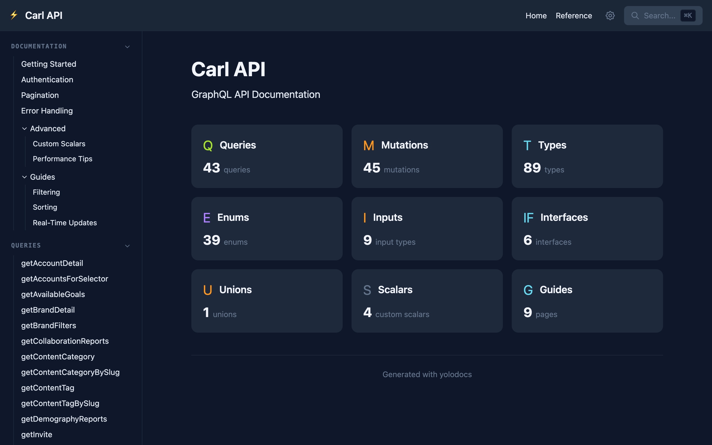
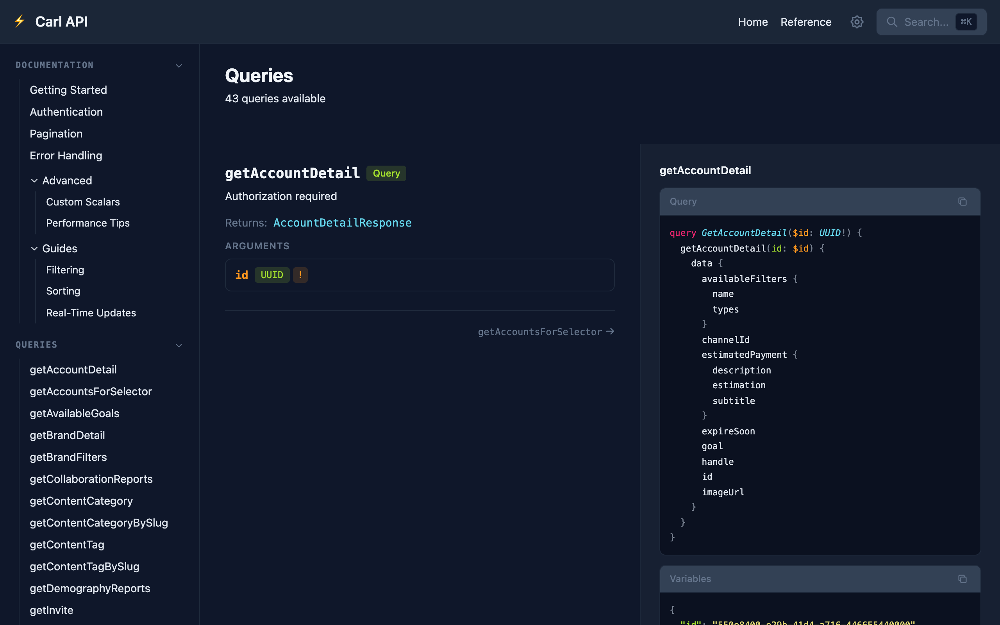
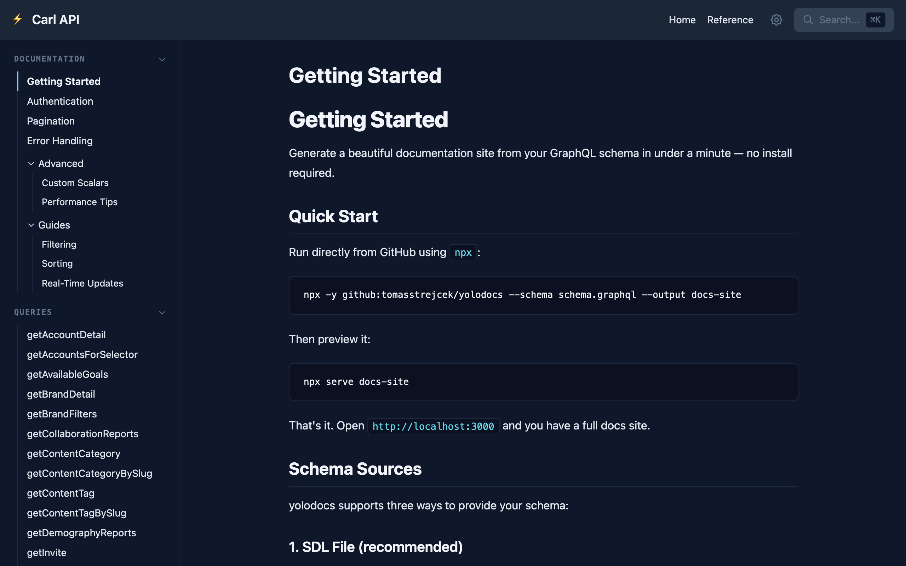

# yolodocs

Generate beautiful, searchable, static documentation sites from GraphQL schemas. One command, zero config, deploy anywhere.

```bash
npx -y github:tomasstrejcek/yolodocs --schema schema.graphql --output docs-site
```



## Why yolodocs?

Most GraphQL documentation tools either require a running server (GraphiQL, Apollo Studio), need complex configuration (SpectaQL), or produce bare-bones output (graphql-markdown). yolodocs takes a different approach:

- **One command** — point at a `.graphql` file or introspection endpoint, get a complete docs site
- **Fully static** — the output is plain HTML/CSS/JS, no server required at runtime
- **Complete out of the box** — auto-generated query/mutation examples, type reference, search, and navigation without any configuration

## What You Get

yolodocs generates a complete documentation site with:

- **API reference** — every query, mutation, subscription, type, enum, interface, union, input, and scalar from your schema, organized in a sidebar with collapsible sections
- **Auto-generated examples** — realistic query/mutation examples with variables and expected responses, generated from your schema's type definitions
- **Type badges** — colored pills showing argument types (green for scalars, purple for enums, blue for objects, orange for non-null `!`)
- **Full-text search** — powered by Pagefind, works entirely client-side with no server
- **Custom guide pages** — write markdown docs alongside the generated reference, with syntax-highlighted code blocks
- **Dark theme UI** — Tailwind CSS v4 dark theme inspired by modern developer tools

### API Reference

Each operation shows its description, return type, arguments with type badges, and a side panel with the auto-generated query, variables, and example response:



### Custom Documentation

Add markdown files with frontmatter to include guide pages. Supports nested folders for collapsible sidebar groups, fenced code blocks with syntax highlighting, and standard markdown formatting:



## Quick Start

```bash
# From a schema file
npx -y github:tomasstrejcek/yolodocs --schema schema.graphql --output docs-site

# From a live endpoint
npx -y github:tomasstrejcek/yolodocs --introspection-url https://api.example.com/graphql --output docs-site

# Preview
npx serve docs-site
```

## CLI Options

| Option | Description | Default |
|--------|-------------|---------|
| `-s, --schema <path>` | Path to GraphQL SDL file | — |
| `--introspection-url <url>` | URL to introspect | — |
| `--introspection-file <path>` | Introspection JSON file | — |
| `-o, --output <path>` | Output directory | `./docs-site` |
| `--title <title>` | Site title | `API Documentation` |
| `--endpoint <url>` | GraphQL endpoint for playground | — |
| `--docs-dir <path>` | Custom markdown docs folder | `./docs` |
| `--base <path>` | Base path prefix for subpath serving (e.g. `/docs`) | — |
| `-c, --config <path>` | Config file path | auto-detected |

## Config File

Create `yolodocs.config.yml` in your project root:

```yaml
title: "My API"
schema: "./schema.graphql"
output: "./docs-site"
endpoint: "https://api.example.com/graphql"
docsDir: "./docs"
base: "/docs"  # optional: serve under a subpath
```

Then just run:

```bash
npx -y github:tomasstrejcek/yolodocs
```

## Custom Docs

Add markdown files to your docs directory with frontmatter:

```markdown
---
title: Authentication
order: 2
---

# Authentication

Your content here. Supports **bold**, `inline code`, tables, blockquotes,
images, and fenced code blocks with syntax highlighting.
```

### Nested Folders

Organize docs into subfolders to create collapsible groups in the sidebar (two levels max):

```
docs/
├── getting-started.md        ← root-level pages appear first
├── authentication.md
├── guides/
│   ├── filtering.md          ← grouped under "Guides"
│   ├── sorting.md
│   └── real-time-updates.md
└── advanced/
    ├── custom-scalars.md     ← grouped under "Advanced"
    └── performance.md
```

Root-level files are listed first, followed by folder groups sorted alphabetically. Each folder becomes a collapsible section in the sidebar, with its name derived from the folder name. Pages within each group are sorted by `order`, then by `title`.

## CI/CD

```yaml
# .github/workflows/docs.yml
name: Docs
on:
  push:
    branches: [main]
jobs:
  build:
    runs-on: ubuntu-latest
    steps:
      - uses: actions/checkout@v4
      - uses: actions/setup-node@v4
        with:
          node-version: 20
      - run: npx -y github:tomasstrejcek/yolodocs --schema schema.graphql --output docs-site --title "My API"
      - uses: actions/upload-pages-artifact@v3
        with:
          path: docs-site
```

## How It Works

1. Parses your GraphQL schema (SDL, introspection URL, or JSON)
2. Generates query/mutation examples with realistic placeholder data
3. Scans your `docs/` folder for custom markdown pages
4. Builds a SolidStart static site with Tailwind CSS
5. Creates a Pagefind search index over all content
6. Outputs a static folder you can deploy anywhere

## Development

```bash
npm run build    # compile TypeScript -> dist/
npm run dev      # watch mode
npm test         # run tests (vitest)
```

End-to-end test with a real schema:

```bash
rm -rf test-output && node dist/bin/yolodocs.js --schema schema.graphql --output test-output --title "Test API" --docs-dir ./docs
npx serve test-output -p 3456
```

`dist/` is committed to git so the tool works via `npx github:tomasstrejcek/yolodocs`. After changing source files, run `npm run build` and commit `dist/` alongside your changes.

## Tech Stack

- [SolidStart](https://start.solidjs.com/) (static preset) for the generated site
- [Tailwind CSS](https://tailwindcss.com/) v4 for styling
- [Pagefind](https://pagefind.app/) for search
- [graphql-js](https://github.com/graphql/graphql-js) for schema parsing
- [Commander.js](https://github.com/tj/commander.js) for the CLI
- [marked](https://github.com/markedjs/marked) for markdown rendering

## License

MIT
